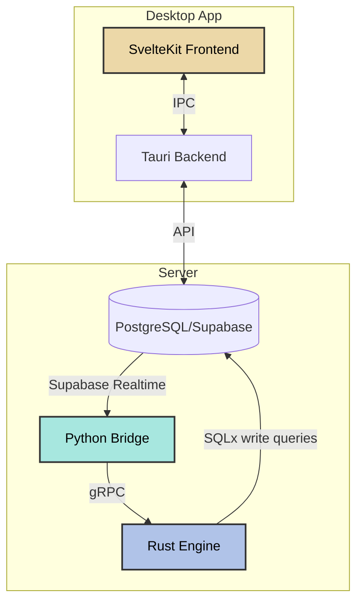

# Portico

An analytic interface engine and database system for scalable data interchange.

## Overview

Portico is a source-available agentic interface engine built with a microservices architecture. It operates in two modes:

1. **Server** - Production-ready concurrent server with multi-threading support
2. **App** - Desktop application that can connect to a server or run locally with embedded database

Built with first-principles design, Portico delivers both exceptional performance and intuitive user experience.

## Architecture



### Components

- **Desktop App** (`/app`) - Tauri 2.0 desktop application with SvelteKit frontend
- **PostgreSQL Database** - Core data storage via Supabase (local or cloud)
- **Python Bridge** (`/server/bridge`) - Converts Supabase realtime events to gRPC calls
- **Rust Engine** (`/server/engine`) - High-performance signal processor and workflow executor
- **Shared Library** (`/lib/shared`) - Common Rust models and database interfaces

## Quick Start

```bash
# Clone repository
git clone https://github.com/Stoa-Medical/Portico.git
cd Portico

# Start backend services
cd server
./start.sh

# In another terminal, start the desktop app
cd app
pnpm install
pnpm tauri dev
```

For detailed setup instructions:
- [Server Documentation](./server/README.txt)
- [App Documentation](./app/README.txt)

## Technology Stack

### Frontend
- **Framework**: SvelteKit 2 with Svelte 5 (Runes API)
- **Desktop**: Tauri 2.0
- **Styling**: TailwindCSS + Flowbite
- **Language**: TypeScript
- **Testing**: Vitest

### Backend
- **Engine**: Rust with Tokio async runtime
- **Bridge**: Python 3.10+ with asyncio
- **Database**: PostgreSQL via Supabase
- **Communication**: gRPC (Protocol Buffers)
- **Schema**: Atlas for migrations

### DevOps
- **Containers**: Docker Compose
- **Package Managers**: pnpm (JS), Cargo (Rust), uv (Python)

## Development

### Prerequisites

- Rust (latest stable)
- Node.js 18+ with pnpm
- Python 3.10+
- Docker & Docker Compose
- PostgreSQL client (psql)
- Supabase CLI
- Atlas CLI (schema & ORM management)
- uv (Python package manager, recommended for fast installs)

### Best Practices

1. **Code Quality**
   - Follow existing patterns and conventions
   - Use standard library over external dependencies when possible
   - Write comprehensive tests for new features
   - Ensure proper error handling with `Result<T, E>` in Rust

2. **Frontend Development**
   - Use Svelte 5 Runes (`$state()`, `$derived()`, `$effect()`)
   - Keep components small and focused
   - Use TypeScript for type safety
   - Follow TailwindCSS utility-first approach

3. **Backend Development**
   - Use async/await patterns consistently
   - Validate all inputs from frontend
   - Log errors appropriately
   - Follow gRPC best practices for service design

4. **Database**
   - Use migrations for schema changes
   - Keep queries performant with proper indexing
   - Use transactions for data consistency

## Features

### Agent Management
- Create and manage workflow agents
- Support for multi-step workflows
- Python script execution
- Web scraping capabilities
- Real-time status updates

### Agent Ownership
Configurable data visibility controls:

- **Default**: All agents visible to all users
- **Scoped**: Users see only their own agents

Toggle via admin settings or programmatically:
```typescript
import { updateConfig } from "$lib/stores/configStore";
updateConfig({ enforceAgentOwnership: true });
```

### Analytics
- Response time tracking
- Success rate monitoring
- Interactive charts and visualizations

## Contributing

See [CONTRIBUTING.md](./CONTRIBUTING.md) for guidelines.

## Security

For security issues, please email security@stoamedical.com instead of using the issue tracker.

## License

This project is licensed under the Business Source License 1.1 (BSL).

**Key Points:**
- Source code is available for viewing and non-production use
- Production use requires a commercial license for:
  - More than 2 production interfaces
  - Over $1M in annual gross charges
- **Converts to Apache 2.0 on July 1, 2030**

See [LICENSE.txt](./LICENSE.txt) for full terms.

## Support

- Documentation: [docs/](./docs/)
- Issues: [GitHub Issues](https://github.com/Stoa-Medical/Portico/issues)
- Email: support@stoamedical.com

---

Built with ❤️ 🐍 ☕️ by Stoa Medical, Inc.
