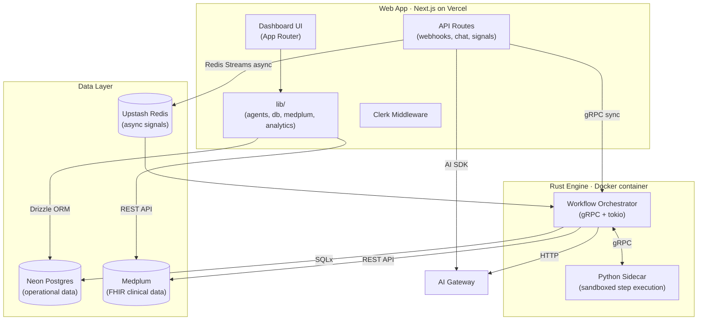

Portico is a **cloud-native agentic integration engine** for healthcare: an event-driven backend (Signals → Agents → Steps) with a web dashboard for configuration, built for healthcare-style integration workflows.

### Architecture


```mermaid
graph TB
    subgraph "Web App · Next.js on Vercel"
        UI["Dashboard UI<br/>(App Router)"]
        API["API Routes<br/>(webhooks, chat, signals)"]
        LIB["lib/<br/>(agents, db, medplum, analytics)"]
        MW["Clerk Middleware"]
    end

    subgraph "Rust Engine · Docker container"
        ENG["Workflow Orchestrator<br/>(gRPC + tokio)"]
        PY["Python Sidecar<br/>(sandboxed step execution)"]
        ENG <-->|gRPC| PY
    end

    subgraph "Data Layer"
        NEON[("Neon Postgres<br/>(operational data)")]
        MED[("Medplum<br/>(FHIR clinical data)")]
        REDIS[("Upstash Redis<br/>(async signals)")]
    end

    UI --> LIB
    API -->|gRPC sync| ENG
    API -->|Redis Streams async| REDIS
    REDIS --> ENG
    ENG -->|SQLx| NEON
    ENG -->|REST API| MED
    LIB -->|Drizzle ORM| NEON
    LIB -->|REST API| MED
    ENG -->|HTTP| AIGW["AI Gateway"]
    API -->|AI SDK| AIGW
```

### Tech Stack

| Layer | Technology |
|-------|-----------|
| **Web framework** | Next.js 15 (App Router, React 19) |
| **Auth** | Clerk |
| **Database** | Neon Postgres (Drizzle ORM) |
| **Clinical data** | Medplum (FHIR R4) |
| **Cache / async signals** | Upstash Redis |
| **AI** | Vercel AI SDK + AI Gateway |
| **Styling** | Tailwind CSS 4, Geist fonts, shadcn/ui |
| **Workflow engine** | Rust (tokio, gRPC) |
| **Python execution** | Python sidecar (FastAPI, sandboxed) |
| **Deployment** | Vercel (web app), Docker (engine + sidecar) |

### Repository Structure

```
├── app/                    # Next.js App Router (pages, layouts, API routes)
│   ├── (auth)/             #   Login / register pages
│   ├── (dashboard)/        #   Dashboard, agents, workflows, mappings, integrations, analytics
│   └── api/                #   Webhook endpoints (HL7, FHIR, Medplum), chat, signals, cron
├── lib/                    # Shared TypeScript modules (imported by app/)
│   ├── db/                 #   Drizzle schema + client (Neon Postgres)
│   ├── agents/             #   Agent types, actions, mapping agent
│   ├── engine/             #   gRPC client for Rust engine
│   ├── medplum/            #   Medplum FHIR client wrapper
│   └── analytics/          #   Analytics query functions
├── server/                 # Backend services (containerized)
│   ├── engine/             #   Rust gRPC workflow orchestrator
│   ├── python-sidecar/     #   Sandboxed Python step execution
│   ├── database/           #   Rust DB crate + Atlas HCL schema
│   ├── proto/              #   Protobuf definitions
│   └── docker-compose.yml  #   Local dev environment
├── design/                 # Design documents
│   └── 2-cloud-native.md   #   Full architecture design doc
├── middleware.ts           # Clerk auth middleware (Next.js root convention)
├── drizzle.config.ts       # Drizzle ORM config
├── next.config.ts          # Next.js config
└── package.json            # Node.js dependencies and scripts
```

> **Note**: `lib/` and `middleware.ts` live at the project root because Next.js treats files inside `app/` as route segments. This is standard Next.js App Router convention — see [Next.js project structure docs](https://nextjs.org/docs/getting-started/project-structure).

### Getting Started

#### Prerequisites

- Node.js 20+
- Docker & Docker Compose (for the Rust engine)

#### Web App (Next.js)

```bash
npm install
cp .env.example .env.local    # Set DATABASE_URL, CLERK keys, etc.
npm run dev                    # http://localhost:3000
```

#### Server (Rust Engine + Python Sidecar)

```bash
cd server
docker compose up --build      # Postgres :54322, Engine :50051, Sidecar :8001
```

Or with tmuxinator for development:

```bash
cd server
tmuxinator start
```

See [server/README.md](server/README.md) for detailed setup.

#### Available Scripts

| Script | Description |
|--------|-------------|
| `npm run dev` | Start Next.js dev server |
| `npm run build` | Production build |
| `npm run start` | Start production server |
| `npm run lint` | ESLint |
| `npm run db:push` | Push Drizzle schema to database |
| `npm run db:generate` | Generate Drizzle migrations |

### Architecture Deep Dive

See [`design/2-cloud-native.md`](design/2-cloud-native.md) for the full design doc covering:
- Rust engine responsibilities (orchestration, parsing, FHIR resource construction)
- Python sidecar architecture (crash isolation, independent scaling)
- Communication patterns (gRPC sync vs Redis Streams async)
- Medplum integration strategy
- AI Gateway usage for LLM steps

### Contributing

See [`CONTRIBUTING.md`](CONTRIBUTING.md).

### Security

For security issues, please email `security@stoamedical.com` instead of using the issue tracker.

### License

Portico is licensed under the **Business Source License 1.1 (BSL 1.1)**.

- **Free** for internal use processing **≤ 2 production interfaces** or generating **≤ $1M** in trailing-12-month gross charges
- **Change date**: **2030-07-01** (converts to **Apache 2.0**)

See [`LICENSE.txt`](LICENSE.txt) for full terms.
