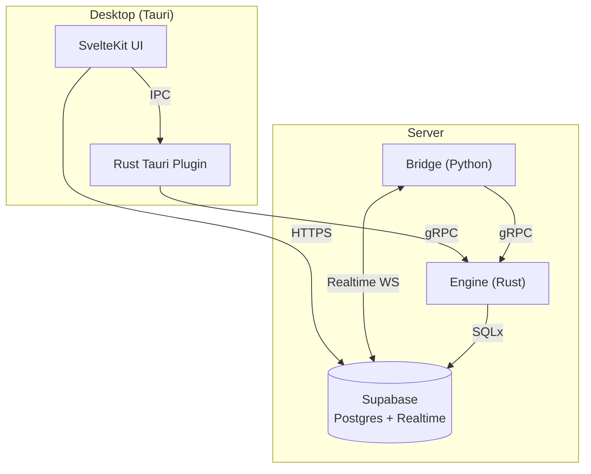

# System Architecture – Big Picture

Portico is an **agent-centric integration engine**. At a high level there are only two deployable artefacts:

1. **Server Stack** – runs the runtime that executes agents.
2. **Desktop App** – a Tauri-based UI and local orchestrator.

## 1. Server Stack

| Component        | Language | Purpose |
| ---------------- | -------- | ------- |
| **Engine**       | Rust     | gRPC service that executes agents, persists results to Postgres (via Supabase) |
| **Bridge**       | Python   | Listens to Supabase Realtime events and forwards them as gRPC calls to Engine |
| **Supabase**     | N/A      | Postgres + Auth + Realtime; single source of truth |

All three services are brought up together via `server/docker-compose.yml`.

## 2. Desktop App

| Component               | Language | Purpose |
| ----------------------- | -------- | ------- |
| **SvelteKit UI**        | TypeScript | Configuration UI, analytics dashboards |
| **Tauri Shell/Plugin**  | Rust     | Native wrapper exposing OS-level features and (optionally) local Engine runtime for demo/offline mode |

## Component Diagram

## Why this split?

* **Supabase** provides auth, Postgres, and a realtime change-feed—dramatically reducing backend boilerplate.
* **Rust Engine** guarantees performance and a strongly typed core while still allowing dynamic Python or LLM steps.
* **Python Bridge** exists because, today, Rust lacks a mature Supabase Realtime SDK.
* **Tauri Desktop** lets us ship a single binary that includes the UI, enabling on-prem or offline demonstrations without standing up the full server stack.
