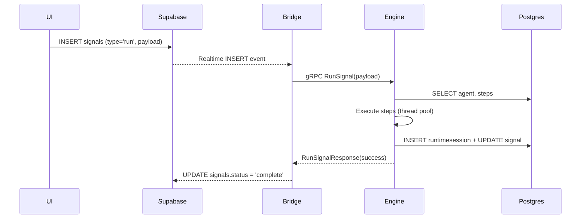
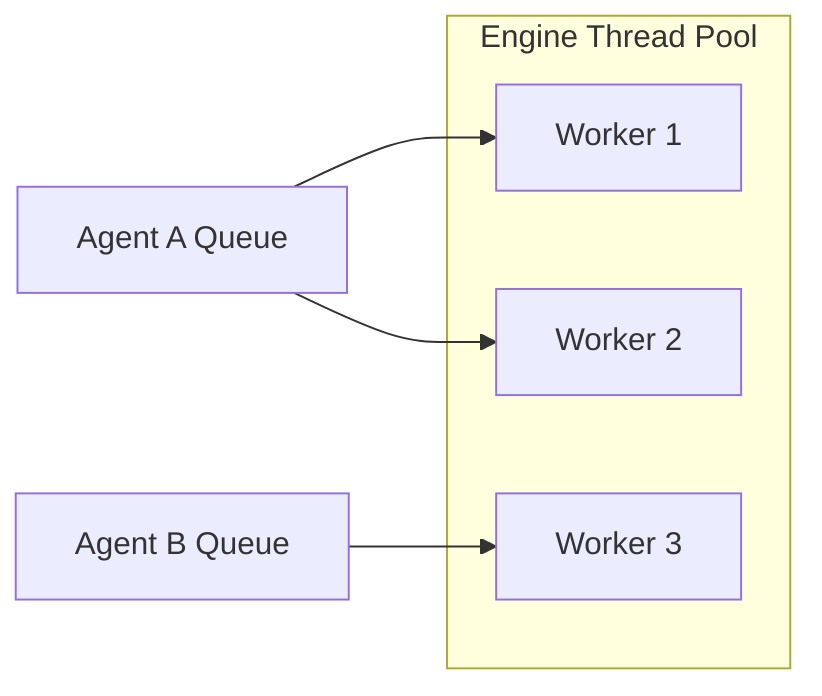

# Data Flow

Below is the canonical sequence when a **Signal** of type `run` is created.

## Other Signal Types

| Type | Purpose |
| ---- | ------- |
| `sync` | Forces Engine to rehydrate its in-memory state from the DB. |
| `fyi`  | Write-only, used for logging or metrics. No runtime execution. |

## Error Handling

* **Bridge** retries transient Supabase failures with exponential back-off (max 5 attempts).
* **Engine** returns a structured `Result` mapping to `signals.error`. Errors bubble back to the UI via Supabase Realtime.

## Agent Queues & Concurrency

Each Agent owns a FIFO queue inside Engine. A shared thread-pool drains the queues respecting ordering per Agent while utilizing CPU cores efficiently.

