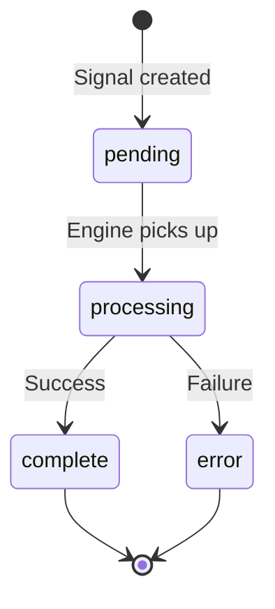
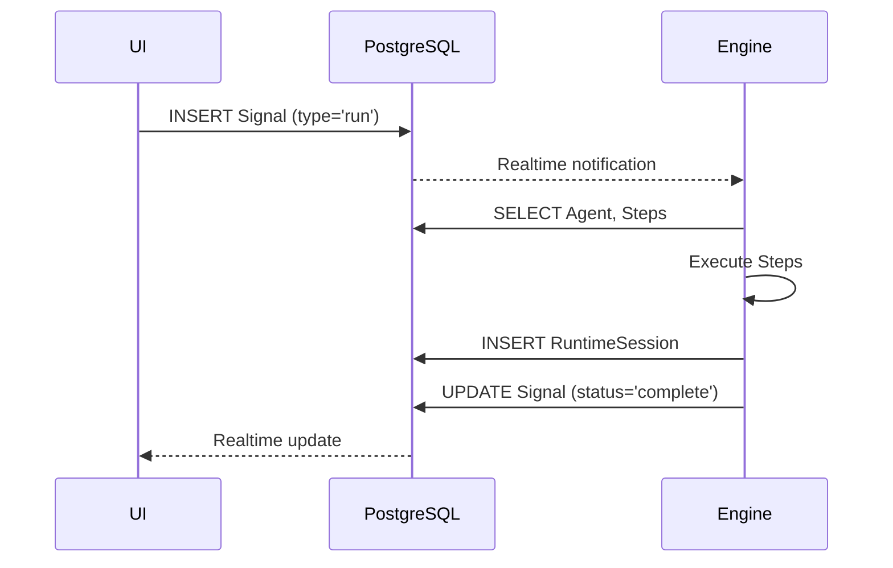

# Data Models

This document describes the core data models that power Portico's event-driven architecture.

## Signal

The fundamental event that drives all activity in Portico.

```typescript
interface Signal {
  id: string;              // UUID
  type: 'run' | 'sync' | 'fyi';
  payload: JsonValue;      // Arbitrary JSON data
  agent_id?: string;       // Target agent (required for 'run')
  status: 'pending' | 'processing' | 'complete' | 'error';
  error?: string;          // Error message if status === 'error'
  runtime_session_id?: string;  // Link to execution record
  created_at: timestamp;
  updated_at: timestamp;
}
```

### Signal Types

- **run**: Executes an Agent with the provided payload
- **sync**: Forces Engine to reload Agent configurations from database
- **fyi**: Information-only signal for logging/metrics

### Signal Lifecycle



## Agent

Represents an automation workflow composed of Steps.

```typescript
interface Agent {
  id: string;              // UUID
  name: string;            // Human-readable identifier
  description: string;     // Purpose and behavior
  is_active: boolean;      // Whether agent processes signals
  owner_id?: string;       // User who created (if ownership enabled)
  steps: Step[];           // Ordered list of actions
  created_at: timestamp;
  updated_at: timestamp;
}
```

### Agent Behavior

- Each Agent maintains its own FIFO queue for Signal processing
- Steps execute sequentially unless configured otherwise
- Failed Steps halt execution and mark Signal as error

## Step

A single action within an Agent workflow.

```typescript
interface Step {
  id: string;              // UUID
  agent_id: string;        // Parent agent
  name: string;            // Step identifier
  type: 'python' | 'llm';  // Execution type
  config: StepConfig;      // Type-specific configuration
  position: number;        // Order within agent
  created_at: timestamp;
  updated_at: timestamp;
}

type StepConfig = PythonConfig | LLMConfig;

interface PythonConfig {
  code: string;            // Python code to execute
  timeout_ms?: number;     // Max execution time
}

interface LLMConfig {
  prompt_template: string; // Template with {{variables}}
  model: string;           // e.g., "gpt-4", "claude-3"
  temperature?: number;    // LLM randomness (0-1)
  max_tokens?: number;     // Response length limit
}
```

### Step Execution

- Input: JSON value from previous step or Signal payload
- Output: JSON value passed to next step
- Errors: Captured and halt Agent execution

## RuntimeSession

Records the execution details of an Agent processing a Signal.

```typescript
interface RuntimeSession {
  id: string;              // UUID
  signal_id: string;       // Triggering signal
  agent_id: string;        // Executing agent
  started_at: timestamp;   // Execution start
  completed_at?: timestamp;// Execution end (null if running)
  status: 'running' | 'success' | 'error';
  step_results: StepResult[];  // Per-step execution data
  error?: string;          // Agent-level error
  created_at: timestamp;
}

interface StepResult {
  step_id: string;
  started_at: timestamp;
  completed_at: timestamp;
  input: JsonValue;
  output?: JsonValue;      // Null if error
  error?: string;          // Step-level error
  duration_ms: number;
}
```

### Analytics Use Cases

- Calculate average execution time per Agent
- Identify bottleneck Steps
- Track error rates and patterns
- Monitor system throughput

## Database Schema

All models are stored in PostgreSQL with:
- UUID primary keys for distributed compatibility
- JSONB columns for flexible payload/config storage
- Indexes on foreign keys and status fields
- Timestamp triggers for automatic updated_at

## Data Flow Example



## Best Practices

1. **Idempotency**: Design Steps to be safely re-runnable
2. **Error Handling**: Always validate JSON schemas between Steps
3. **Timeouts**: Set reasonable limits on Python/LLM Steps
4. **Monitoring**: Use RuntimeSession data for performance tracking
5. **Versioning**: Consider Agent versioning for production deployments
