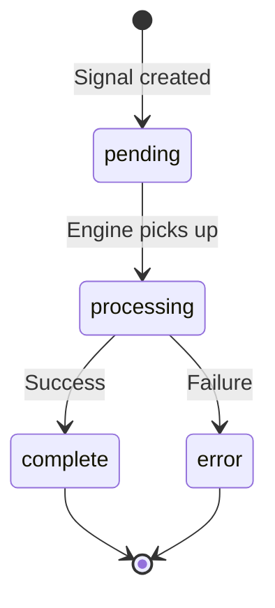
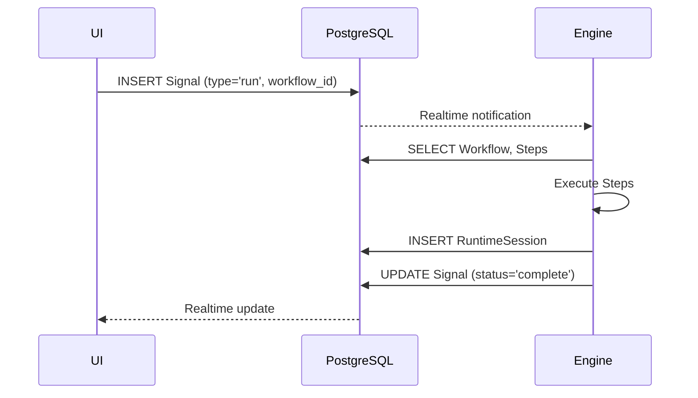

# Data Models

This document describes the core data models that power Portico's event-driven architecture.

## Signal

The fundamental event that drives all activity in Portico.

```typescript
interface Signal {
  id: string;              // UUID
  type: 'run' | 'sync' | 'fyi';
  payload: JsonValue;      // Arbitrary JSON data
  workflow_id: string;              // Target workflow (required for 'run')
  initiator_agent_id?: string;      // Agent that initiated (optional)
  status: 'pending' | 'processing' | 'complete' | 'error';
  error?: string;          // Error message if status === 'error'
  runtime_session_id?: string;  // Link to execution record
  created_at: timestamp;
  updated_at: timestamp;
}
```

### Signal Types

- **run**: Executes a Workflow with the provided payload
- **sync**: Forces Engine to reload Workflow configurations from database
- **fyi**: Information-only signal for logging/metrics

### Signal Lifecycle


```mermaid
stateDiagram-v2
  [*] --> pending: Signal created
  pending --> processing: Engine picks up
  processing --> complete: Success
  processing --> error: Failure
  complete --> [*]
  error --> [*]
```

## Agent

The orchestrator that plans and validates Workflows. Agents have capabilities and policies that constrain what workflows they can create and execute.

```typescript
interface Agent {
  id: string;                       // UUID
  name: string;
  description?: string;
  is_active: boolean;
  owner_id?: string;
  capabilities: AgentCapabilities;  // tools, models, limits
  policy: AgentPolicy;              // constraints, allowed patterns
  created_at: timestamp;
  updated_at: timestamp;
}
```

## Workflow

The executable unit that contains and runs Steps. Each Workflow maintains its own execution queue and produces RuntimeSessions when executed.

```typescript
interface Workflow {
  id: string;                       // UUID
  name?: string;
  description?: string;
  workflow_state: 'inactive' | 'stable' | 'unstable';
  workflow_type?: string;
  created_by_agent_id?: string;     // Agent that composed this workflow
  step_ids?: number[];
  version: string;
  is_ephemeral: boolean;
  created_at: timestamp;
  updated_at: timestamp;
}
```

### Workflow Behavior

- Each Workflow maintains its own FIFO queue for Signal processing
- Steps execute sequentially unless configured otherwise
- Failed Steps halt execution and mark Signal as error

## Step

A single action within a Workflow.

```typescript
interface Step {
  id: string;              // UUID
  workflow_id: string;              // Parent workflow
  name: string;            // Step identifier
  type: 'python' | 'llm';  // Execution type
  config: StepConfig;      // Type-specific configuration
  position: number;                 // Order within workflow
  created_at: timestamp;
  updated_at: timestamp;
}

type StepConfig = PythonConfig | LLMConfig;

interface PythonConfig {
  code: string;            // Python code to execute
  timeout_ms?: number;     // Max execution time
}

interface LLMConfig {
  prompt_template: string; // Template with {{variables}}
  model: string;           // e.g., "gpt-4", "claude-3"
  temperature?: number;    // LLM randomness (0-1)
  max_tokens?: number;     // Response length limit
}
```

### Step Execution

- Input: JSON value from previous step or Signal payload
- Output: JSON value passed to next step
- Errors: Captured and halt Workflow execution

## RuntimeSession

Records the execution details of a Workflow processing a Signal.

```typescript
interface RuntimeSession {
  id: string;                       // UUID
  signal_id: string;                // Triggering signal
  workflow_id: string;              // Executed workflow
  initiator_agent_id?: string;      // Agent initiating run (optional)
  started_at: timestamp;            // Execution start
  completed_at?: timestamp;         // Execution end (null if running)
  status: 'running' | 'success' | 'error';
  step_results: StepResult[];       // Per-step execution data
  error?: string;                   // Workflow-level error
  created_at: timestamp;
}

interface StepResult {
  step_id: string;
  started_at: timestamp;
  completed_at: timestamp;
  input: JsonValue;
  output?: JsonValue;      // Null if error
  error?: string;          // Step-level error
  duration_ms: number;
}
```

### Analytics Use Cases

- Calculate average execution time per Workflow
- Aggregate metrics across workflows created by each Agent
- Identify bottleneck Steps
- Track error rates and patterns
- Monitor system throughput

## Database Schema

All models are stored in PostgreSQL with:
- UUID primary keys for distributed compatibility
- JSONB columns for flexible payload/config storage
- Indexes on foreign keys and status fields
- Timestamp triggers for automatic updated_at

## Data Flow Example


```mermaid
sequenceDiagram
  participant UI
  participant DB as PostgreSQL
  participant Engine

  UI->>DB: INSERT Signal (type='run', workflow_id)
  DB-->>Engine: Realtime notification
  Engine->>DB: SELECT Workflow, Steps
  Engine->>Engine: Execute Steps
  Engine->>DB: INSERT RuntimeSession
  Engine->>DB: UPDATE Signal (status='complete')
  DB-->>UI: Realtime update
```

## Best Practices

1. **Idempotency**: Design Steps to be safely re-runnable
2. **Error Handling**: Always validate JSON schemas between Steps
3. **Timeouts**: Set reasonable limits on Python/LLM Steps
4. **Monitoring**: Use RuntimeSession data for performance tracking
5. **Versioning**: Consider Workflow versioning for production deployments

## Key Relationships

- Agents (1) ← (many) Workflows
- Workflows (1) ← (many) Steps
- Workflows (1) ← (many) Signals, RuntimeSessions
